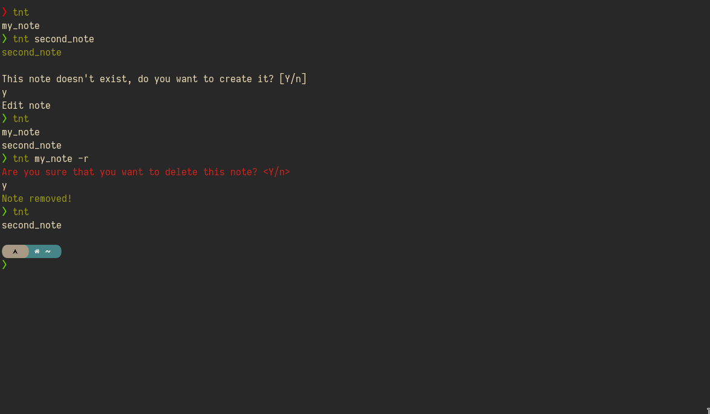

# tnt

`tnt` is a program to manage notes in your terminal. It uses files in the
[Markdown](https://en.wikipedia.org/wiki/Markdown) format, so it's possible
to sync the files between devices

Quick links

- [How to use](#how-to-use)
- [Installation](INSTALL.md)

## Demo



## How to use

First, to get an overview of all available command line options, you can either run
[`tnt -h`](#command-line-options) for a concise help message or `man tnt` for a more detailed
version.

#### Examples

Create a note

```bash
tnt "note_name"
```

If the note already exists, the default `$EDITOR` will be used to edit the note

Remove a note

```bash
tnt "note_name" -r
```

List all notes

```bash
tnt
```

Note that to list all notes no arguments are necessary

### Command-line options

This is the output of `tnt -h`. To see the full set of command-line options, use `man tnt` which
also includes a much more detailed help text.

```
Usage: 
  tnt NOTE [OPTIONS]

META OPTIONS:
    -h, --help          show list of command-line options
    -v, --version       show version of tnt
OPTIONS:
    -r, --remove        remove the defined note
ARGS:
    <NOTE>              input note";
```
